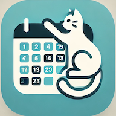

# ^..^ CAT Calendar HarmonyOS

CAT Calendar is a calendar application for Huawei HarmonyOS, built using the QuickAPP IDE. 

## Features

- **Calendar Interface:** A calendar interface with monthly and daily views.
- **Sunrise and Sunset Times:** Displays  sunrise and sunset times based on the user's location.
- **Moon Phases:** Automatically calculates and displays the current moon phase with corresponding emojis.
- **Dynamic Date Display:** The app shows the current date, month, and day of the week.
- **Huawei HarmonyOS Integration:** The app is specifically designed to run on Huawei HarmonyOS devices, utilizing the capabilities of the QuickAPP IDE.

